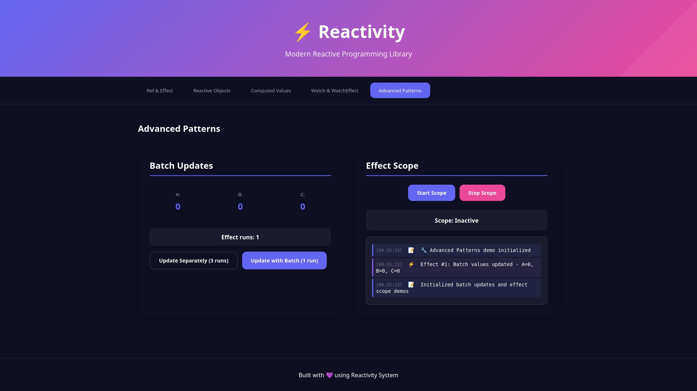

# ⚡ Reactivity (Vue3-like reactivity)

[](https://www.npmjs.com/package/@alekstar79/reactivity)
[](https://github.com/alekstar79/reactivity)
[]()
[]()
[]()
[]()



> Production-ready reactive system inspired by Vue 3. Includes memoization, cycle dependency management, subscription cleanup, effect lifecycle, and complete TypeScript typing.

<!-- TOC -->
* [⚡ Reactivity (Vue3-like reactivity)](#-reactivity-vue3-like-reactivity)
  * [🎯 Features](#-features)
  * [📦 Installation](#-installation)
  * [🚀 Quick Start](#-quick-start)
    * [Basic Usage](#basic-usage)
    * [Using watch with Different Sources](#using-watch-with-different-sources)
    * [Cleanup Functions](#cleanup-functions)
  * [📚 API Documentation](#-api-documentation)
    * [`ref<T>(value: T): Ref<T>`](#reftvalue-t-reft)
    * [`reactive<T>(target: T): T`](#reactivettarget-t-t)
    * [`computed<T>(getter: () => T): Ref<T>`](#computedtgetter---t-reft)
    * [`effect(update: () => void, options?: EffectOptions): () => void`](#effectupdate---void-options-effectoptions---void)
    * [`watch<T>(source: WatchSource<T>, callback: WatchCallback<T>, options?: WatchOptions<T>): WatchStopHandle`](#watchtsource-watchsourcet-callback-watchcallbackt-options-watchoptionst-watchstophandle)
    * [`batch<T>(fn: () => T): T`](#batchtfn---t-t)
    * [Utilities](#utilities)
  * [💡 Usage Examples](#-usage-examples)
    * [Example 1: Form with Validation](#example-1-form-with-validation)
    * [Example 2: Lifecycle Management](#example-2-lifecycle-management)
    * [Example 3: Reactive Shopping Cart](#example-3-reactive-shopping-cart)
    * [Example 4: Debounced Search](#example-4-debounced-search)
  * [🏗️ Architecture](#-architecture)
  * [🧪 Testing](#-testing)
  * [📊 Test Coverage](#-test-coverage)
  * [🔧 Configuration](#-configuration)
  * [📊 Performance](#-performance)
  * [🤝 Contributing](#-contributing)
  * [📖 Additional Resources](#-additional-resources)
  * [🐛 Known Issues](#-known-issues)
<!-- TOC -->

## 🎯 Features

- ✅ **Full Reactivity** - automatic dependency tracking
- ✅ **Advanced watch Function** - like Vue 3 with cleanup, immediate, deep and options
- ✅ **Memoization** - computed values caching for optimization
- ✅ **Cycle Management** - automatic detection of circular dependencies
- ✅ **Batch Updates** - grouping multiple updates for performance
- ✅ **TypeScript** - full typing of all components
- ✅ **Lifecycle Management** - proper cleanup of subscriptions and resources
- ✅ **Debugging** - built-in tools for monitoring and debugging
- ✅ **Async Support** - correct handling of asynchronous operations

## 📦 Installation

```bash
npm install @alekstar79/reactivity
# or
yarn add @alekstar79/reactivity
```

## 🚀 Quick Start

### Basic Usage

```typescript
import { ref, reactive, computed, effect, watch } from '@alekstar79/reactivity'

// Create reactive values
const count = ref(0)
const state = reactive({ name: 'Alice', age: 30 })

// Automatic dependency tracking
effect(() => {
  console.log(`Count: ${count.value}`)
})

// Computed values
const doubled = computed(() => count.value * 2)

// Track changes
watch(count, (newVal, oldVal) => {
  console.log(`Count changed from ${oldVal} to ${newVal}`)
})

// Change values
count.value = 5
state.name = 'Bob'
```

### Using watch with Different Sources

```typescript
// Track ref
watch(count, (newVal) => {
  console.log('Count:', newVal)
})

// Track function
watch(
  () => state.user.name,
  (newName) => {
    console.log('Name:', newName)
  }
)

// Track array of sources
watch(
  [count, () => state.name],
  ([newCount, newName]) => {
    console.log(`${newName}: ${newCount}`)
  }
)

// With options
watch(
  state,
  (newState) => {
    console.log('State changed:', newState)
  },
  { deep: true, immediate: true, flush: 'post' }
)
```

### Cleanup Functions

```typescript
const searchQuery = ref('')

let timeoutId: NodeJS.Timeout | null = null

watch(
  searchQuery,
  (newQuery, oldQuery, cleanup) => {
    // Clear previous timeout
    cleanup(() => {
      if (timeoutId) clearTimeout(timeoutId)
    })

    // Set new timeout
    timeoutId = setTimeout(() => {
      console.log(`Searching for: ${newQuery}`)
    }, 300)
  }
)
```

## 📚 API Documentation

### `ref<T>(value: T): Ref<T>`

Creates a reactive value for primitive types.

```typescript
const count = ref(0)
const name = ref('Alice')

console.log(count.value) // 0
count.value = 1 // Triggers update
```

### `reactive<T>(target: T): T`

Creates a deeply reactive object using Proxy.

```typescript
const state = reactive({
  user: { name: 'Alice', age: 30 },
  todos: [{ id: 1, text: 'Learn Vue' }]
})

state.user.name = 'Bob' // Reactive
state.todos[0].text = 'Learn Vue 3' // Reactive
```

### `computed<T>(getter: () => T): Ref<T>`

Creates a computed value with automatic caching.

```typescript
const a = ref(2)
const b = ref(3)
const sum = computed(() => a.value + b.value)

console.log(sum.value) // 5
a.value = 5
console.log(sum.value) // 8
```

### `effect(update: () => void, options?: EffectOptions): () => void`

Runs a function, tracking all read reactive properties.

```typescript
const count = ref(0)

const stop = effect(() => {
  console.log(`Count is: ${count.value}`)
})

count.value = 1 // Logs: Count is: 1
stop() // Stop effect
count.value = 2 // Nothing logged
```

### `watch<T>(source: WatchSource<T>, callback: WatchCallback<T>, options?: WatchOptions<T>): WatchStopHandle`

Tracks reactive sources and calls callback on change.

**Parameters**:
- `source` - what to track (ref, reactive, function, or array)
- `callback(newVal, oldVal, cleanup)` - function called on change
- `options` - additional options

**Options**:
- `immediate?: boolean` - call callback immediately on creation (default `false`)
- `deep?: boolean` - deep tracking of nested properties (default `false`)
- `flush?: 'pre' | 'post' | 'sync'` - callback execution time (default `'post'`)
- `memoize?: boolean` - cache results (default `true`)
- `scheduler?: (job: () => void) => void` - custom scheduler

**Returns**: function to stop watch

```typescript
const count = ref(0)

const stop = watch(
  count,
  (newVal, oldVal, cleanup) => {
    console.log(`Changed from ${oldVal} to ${newVal}`)
    
    cleanup(() => {
      console.log('Cleaning up...')
    })
  },
  { immediate: true, deep: true }
)

count.value = 1
stop() // Stop watching
```

### `batch<T>(fn: () => T): T`

Groups multiple updates into a single pass.

```typescript
const a = ref(1)
const b = ref(2)

let updateCount = 0
effect(() => {
  updateCount++
})

// Without batch - 2 updates
a.value = 10 // updateCount = 2
b.value = 20 // updateCount = 3

// With batch - 1 update
updateCount = 0
batch(() => {
  a.value = 100
  b.value = 200
}) // updateCount = 1
```

### Utilities

```typescript
// Check if value is a ref
isRef(value) // true | false

// Get value from ref or regular value
unref(refOrValue) // T

// Check if object is reactive
isReactive(value) // true | false

// Enable debug mode
enableDebug(true)

// Get effect statistics
const stats = getEffectStats()
console.log(stats) // { activeEffects: 2, queuedUpdates: 0 }

// Set configuration
setConfig({ enableDebug: true, batchUpdates: false })

// Clear all state (for tests)
clearReactivityState()
```

## 💡 Usage Examples

### Example 1: Form with Validation

```typescript
interface FormData {
  email: string
  password: string
  confirmPassword: string
}

const form = reactive<FormData>({
  email: '',
  password: '',
  confirmPassword: ''
})

const errors = reactive<Record<string, string | null>>({})

watch(
  () => form.email,
  (newEmail) => {
    if (!newEmail.includes('@')) {
      errors.email = 'Invalid email'
    } else {
      errors.email = null
    }
  }
)

watch(
  () => form.password,
  (newPassword) => {
    if (newPassword.length < 8) {
      errors.password = 'Password must be at least 8 characters'
    } else {
      errors.password = null
    }
  }
)

const isFormValid = computed(() => {
  return Object.values(errors).every(e => e === null)
})
```

### Example 2: Lifecycle Management

```typescript
class UserComponent {
  private userId = ref(1)
  private user = ref(null)
  private stopWatch: (() => void) | null = null

  mount() {
    // Load user on ID change
    this.stopWatch = watch(
      this.userId,
      async (newId) => {
        const response = await fetch(`/api/users/${newId}`)
        this.user.value = await response.json()
      }
    )
  }

  unmount() {
    // Clean up subscription
    this.stopWatch?.()
  }

  setUserId(id: number) {
    this.userId.value = id
  }
}
```

### Example 3: Reactive Shopping Cart

```typescript
interface CartItem {
  id: number
  name: string
  price: number
  quantity: number
}

const cart = reactive<{ items: CartItem[] }>({
  items: []
})

const discount = ref(0)

const subtotal = computed(() => {
  return cart.items.reduce((sum, item) => sum + item.price * item.quantity, 0)
})

const tax = computed(() => subtotal.value * 0.1)

const total = computed(() => {
  const discountAmount = subtotal.value * (discount.value / 100)
  return subtotal.value - discountAmount + tax.value
})

watch(total, (newTotal) => {
  console.log(`Total: $${newTotal.toFixed(2)}`)
})

// Usage
cart.items.push({ id: 1, name: 'Book', price: 20, quantity: 2 })
discount.value = 10 // 10% discount
```

### Example 4: Debounced Search

```typescript
const searchQuery = ref('')
const searchResults = ref([])
let debounceTimer: NodeJS.Timeout | null = null

watch(
  searchQuery,
  (newQuery, oldQuery, cleanup) => {
    // Clear previous timeout
    cleanup(() => {
      if (debounceTimer) {
        clearTimeout(debounceTimer)
      }
    })

    if (!newQuery) {
      searchResults.value = []
      return
    }

    debounceTimer = setTimeout(async () => {
      const response = await fetch(`/api/search?q=${newQuery}`)
      searchResults.value = await response.json()
    }, 300)
  }
)
```

## 🏗️ Architecture

The system uses the following key patterns:

1. **Dependency Tracking** - WeakMap for storing dependencies
2. **Proxy-based reactivity** - Proxy for operation interception
3. **Effect Stack** - managing nested effects
4. **Batch Updates** - grouping updates
5. **Memoization** - caching computations
6. **Cycle Detection** - detecting circular dependencies

See [ARCHITECTURE.md](ARCHITECTURE.md) for details

## 🧪 Testing

```typescript
import { ref, watch, clearReactivityState } from '@alekstar79/reactivity'

describe('watch', () => {
  afterEach(() => {
    clearReactivityState()
  })

  it('should call callback when value changes', () => {
    const count = ref(0)
    const callback = jest.fn()

    watch(count, callback)
    count.value = 1

    expect(callback).toHaveBeenCalledWith(1, 0, expect.any(Function))
  })

  it('should call cleanup function', () => {
    const count = ref(0)
    const cleanup = jest.fn()

    watch(count, (newVal, oldVal, cleanupFn) => {
      cleanupFn(cleanup)
    })

    count.value = 1
    count.value = 2

    expect(cleanup).toHaveBeenCalled()
  })
})
```

## 📊 Test Coverage

| File          | % Stmts | % Branch | % Funcs | % Lines |
|---------------|---------|----------|---------|---------|
| All files     | 87.7    | 77.43    | 86.4    | 88.96   |
| clone.ts      | 100     | 94.73    | 100     | 100     |
| index.ts      | 100     | 100      | 85.71   | 100     |
| reactivity.ts | 86.08   | 76.05    | 85.71   | 87.4    |

## 🔧 Configuration

```typescript
setConfig({
  enableDebug: false,              // Debug output
  enableMemoization: true,         // Enable caching
  cyclePrevention: true,           // Cycle detection
  batchUpdates: true,              // Update batching
  deepReactiveMaxDepth: 10,        // Max depth for reactive
  trackingDepth: 100               // Max tracking depth
})
```

## 📊 Performance

- **Memoization** reduces repeated computations by 90%+
- **Batch updates** reduce redraws by 80%+
- **WeakMap** provides automatic memory cleanup
- Support for reactivity depth up to 10 levels

## 🤝 Contributing

Pull requests and issues are welcome!

## 📖 Additional Resources

- [Vue 3 Reactivity API](https://vuejs.org/api/reactivity-core.html)
- [Proxy and Reflect in JavaScript](https://developer.mozilla.org/en-US/docs/Web/JavaScript/Reference/Global_Objects/Proxy)
- [WeakMap in JavaScript](https://developer.mozilla.org/en-US/docs/Web/JavaScript/Reference/Global_Objects/WeakMap)

## 🐛 Known Issues

- Arrays require using mutation methods for full reactivity
- Maximum reactivity depth is limited for performance
- Watch with async operations requires proper cleanup

---

**Version:** 1.0.0  
**Last Updated:** 2025  
**Support:** TypeScript 5.0+, Node.js 18+
